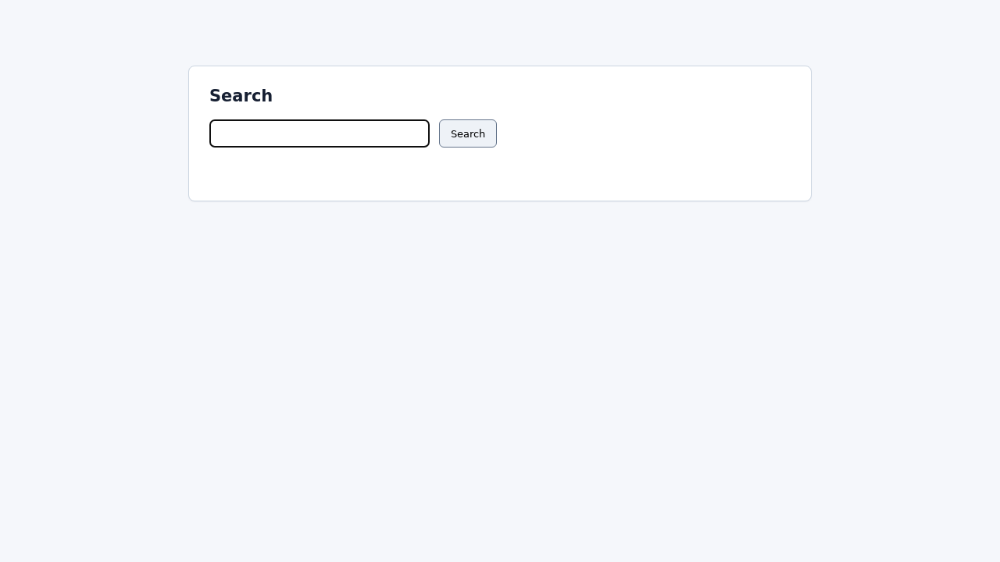
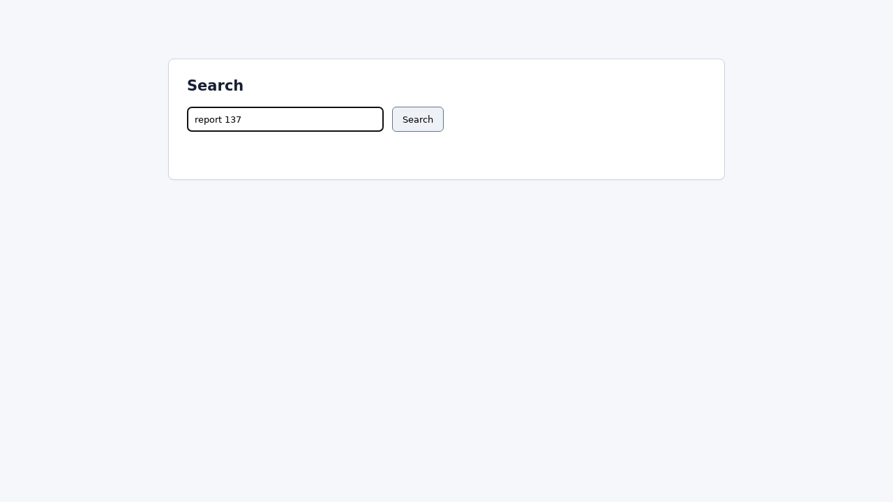
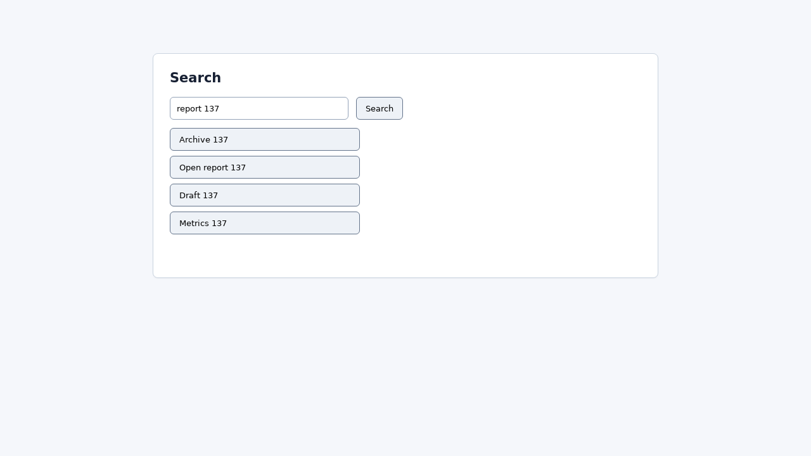
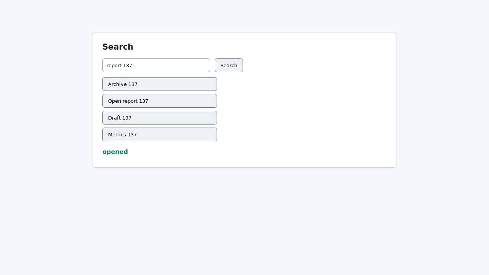

# BrowserRL GRPO Batch 与 Reward/Loss 逐步计算示例

- 生成时间：2026-05-29 14:56 CST
- 示例任务：`suite_search_137`
- 示例类型：`search_select`
- 相关代码：
  - `scripts/train_browser_rl_onpolicy_grpo.py`
  - `envs/browser_rl/playwright_env.py`
  - `envs/browser_rl/verifier.py`

## 0. 先回答最核心的问题

`reward` 和 `loss` 的关系是：

```text
reward 不直接反向传播。
reward 先变成 advantage。
advantage 再作为权重，乘到模型输出该 action 的 log probability 上。
最后优化 loss，使高 reward action 的概率上升，低 reward action 的概率下降。
```

当前一个 group 的 RL loss 是：

```text
A_i = (r_i - mean(r_group)) / std(r_group)

L_RL = - mean_i [ A_i * log pi_theta(a_i | image, prompt, history) ]
```

其中：

- `r_i`：第 i 个候选动作的 reward。
- `A_i`：advantage，中文可理解为“这个动作比同组平均水平好多少”。
- `pi_theta`：当前模型策略，也就是 Qwen2.5-VL LoRA adapter。
- `log pi_theta(a_i | image, prompt, history)`：模型在当前截图和 prompt 下生成这个 action JSON 的 log probability。

如果某个动作 reward 高于同组平均值，则 `A_i > 0`，训练会提高它的概率。

如果某个动作 reward 低于同组平均值，则 `A_i < 0`，训练会降低它的概率。

## 1. `L_total = L_RL + lambda * L_SFT` 是什么

当前总损失是：

```text
L_total = L_RL + lambda * L_SFT
```

但不是每个 group 都一定有 `L_SFT`。当前 `replay_ratio=0.40`，意思是每处理一个 RL group，大约 40% 概率额外抽 1 条 SFT replay 样本。

### 1.1 `L_RL` 是什么

`L_RL` 是 group-relative RL loss。

对同一个状态采样多个候选动作：

```text
a_1, a_2, ..., a_K
```

环境执行每个动作，得到：

```text
r_1, r_2, ..., r_K
```

再做组内标准化：

```text
A_i = (r_i - mean(r)) / std(r)
```

最后：

```text
L_RL = - mean_i [ A_i * log pi_theta(a_i | s) ]
```

这里的 `s` 不是纯文本状态，而是：

- 当前截图 image
- 任务 goal
- 当前 step
- max_steps
- action_space
- verifier progress
- 最近 history

### 1.2 `L_SFT` 是什么

`SFT` 是 supervised fine-tuning，中文是监督微调。`SFT replay` 是从旧的示范数据里抽一条“状态 -> 正确 action”样本，让模型别忘掉原来学会的基础能力。

当前 `L_SFT` 是负对数似然：

```text
L_SFT = - log pi_theta(a_demo | image_demo, prompt_demo)
```

如果使用 mean-token reduction，则实际是 assistant completion 每个 token 的平均负 log probability。

它不是 KL 散度。

`KL` 是 Kullback-Leibler divergence，中文常叫 KL 散度，用来衡量两个分布之间的差异。如果做 KL，通常会写成：

```text
L_KL = beta * KL(pi_theta(.|s) || pi_ref(.|s))
```

但当前代码没有加载 reference model，也没有计算分布 KL。当前只是：

```text
L_total = L_RL + 0.08 * L_SFT
```

`0.08` 就是 `lambda`，也就是 `replay_loss_weight`。

## 2. 当前 reward 为什么说有两层

当前 reward 有两层，是为了把“环境任务结果”和“训练时的额外惩罚/修正”分开。

### 2.1 第一层：env_reward

`env_reward` 来自环境里的 verifier。

verifier 是验证器，用程序读取网页 DOM 状态。`DOM` 是网页元素树，Playwright 可以检查输入框内容、按钮是否出现、某个内部变量是否成功。

当前 verifier reward 规则：

```text
if success:
    env_reward = 1.0
elif progress_flags 存在:
    env_reward = 0.2 * true_progress_count / progress_count
else:
    env_reward = 0.0
```

### 2.2 第二层：shaped reward

`shaped reward` 是训练脚本在 env_reward 上做的额外修正：

```text
reward = env_reward
       - step_cost
       + success_bonus * 1[success]
       - invalid_penalty * 1[invalid_json_or_action]
       - exec_error_penalty * 1[exec_error]
```

最近实验基本使用：

```text
step_cost = 0.0
success_bonus = 0.0
invalid_penalty = 0.2
exec_error_penalty = 0.2
```

所以只要 action 合法且执行成功，训练用的 reward 基本等于 env_reward。

两层的意义是：

- `env_reward` 表达任务本身：是否完成、是否有进展。
- `shaped reward` 表达训练偏好：非法 JSON、非法 action、执行错误要扣分。

## 3. 当前一个 batch 到底是什么

严格说，当前实现没有把很多样本拼成一个传统大 batch tensor。

实际实现是：

```text
一个 micro-batch = 一个 group
一个 optimizer step = 累积多个 group 的梯度后更新一次
```

最近训练常用：

```text
gradient_accumulation_steps = 8
```

也就是说，一个 optimizer step 大约包含：

```text
8 个 RL groups
+ 期望 8 * 0.40 = 3.2 条 SFT replay rows
```

但它们不是一次性拼成一个 batch tensor，而是顺序计算 loss、顺序 backward、累积梯度，到了 8 个 group 后做一次 optimizer.step。

### 3.1 一个 group 里有什么

一个 group 包含：

- 1 张当前状态截图
- 1 段 prompt 文本
- 最近 history
- 多个候选 action JSON
- 每个候选 action 执行后的 reward
- 每个候选 action 执行后的分支截图

训练时计算 log probability 用的是：

```text
当前状态截图 + 当前 prompt + 候选 action JSON
```

候选 action 执行后的分支截图不作为当前 action 的输入。它的作用是：

```text
用于 verifier 计算 reward，并作为调试/报告证据保存。
```

## 4. 非 advanced_scroll 完整例子：search_select

任务：

```text
task_id: suite_search_137
goal: Search for report 137 and open the result named Open report 137.
template: search_select
max_steps: 6
```

这个 group 是：

```text
group_id: onpolicy_100tg_g00021
step: 3
samples: 4
reward: [0.2, 1.0, 0.2, 1.0]
reward_mean: 0.6
reward_std: 0.4
```

它不是初始状态，而是任务已经执行到第 3 步后的状态。

## 5. 前置 history：这不是纯文本想象，确实有截图

### History Step 1：点击搜索框

动作：

```json
{"action":"click","x":346.0,"y":214.0}
```



### History Step 2：输入 query

动作：

```json
{"action":"type","text":"report 137"}
```



### History Step 3：点击 Search，出现搜索结果

动作：

```json
{"action":"click","x":459.0,"y":224.0}
```

verifier progress：

```json
{"searched": true}
```

reward：

```text
0.2
```

因为搜索结果出现了，但还没有点开正确结果。

当前 group 的状态截图如下：


模型此时看到的不是“任务类型 search_select”这个标签，而是：

- 当前截图中有输入框、Search 按钮、4 个结果按钮。
- goal 说要打开 `Open report 137`。
- history 里已经有搜索动作，progress 是 `searched=true`。

## 6. 同一个 group 里的 4 个候选动作

这个 group 里有 4 个候选动作。它们从同一个当前状态出发，各自执行一步。

### Branch 0：点到 Archive 137，失败但搜索进展仍保留

动作：

```json
{"action":"click","x":299.0,"y":334.0}
```

结果：

```text
success = false
env_reward = 0.2
training reward = 0.2
```

原因：点到的不是 `Open report 137`，但页面仍处于 searched=true 的进展状态。



### Branch 1：点到 Open report 137，成功

动作：

```json
{"action":"click","x":298.0,"y":357.0}
```

结果：

```text
success = true
env_reward = 1.0
training reward = 1.0
```


### Branch 2：仍然点偏，失败

动作：

```json
{"action":"click","x":262.0,"y":327.0}
```

结果：

```text
success = false
env_reward = 0.2
training reward = 0.2
```


### Branch 3：点到 Open report 137，成功

动作：

```json
{"action":"click","x":337.0,"y":358.0}
```

结果：

```text
success = true
env_reward = 1.0
training reward = 1.0
```



## 7. 这个 group 怎样计算 advantage

reward 列表：

```text
r = [0.2, 1.0, 0.2, 1.0]
```

均值：

```text
mean = (0.2 + 1.0 + 0.2 + 1.0) / 4 = 0.6
```

标准差：

```text
std = 0.4
```

所以 advantage 是：

```text
A_0 = (0.2 - 0.6) / 0.4 = -1
A_1 = (1.0 - 0.6) / 0.4 =  1
A_2 = (0.2 - 0.6) / 0.4 = -1
A_3 = (1.0 - 0.6) / 0.4 =  1
```

也就是：

| branch | action | reward | advantage | 训练方向 |
| ---: | --- | ---: | ---: | --- |
| 0 | click(299,334) | 0.2 | -1 | 降低概率 |
| 1 | click(298,357) | 1.0 | +1 | 提高概率 |
| 2 | click(262,327) | 0.2 | -1 | 降低概率 |
| 3 | click(337,358) | 1.0 | +1 | 提高概率 |

## 8. 这个 group 怎样计算 L_RL

令：

```text
logp_0 = log pi_theta(click(299,334) | image, prompt, history)
logp_1 = log pi_theta(click(298,357) | image, prompt, history)
logp_2 = log pi_theta(click(262,327) | image, prompt, history)
logp_3 = log pi_theta(click(337,358) | image, prompt, history)
```

那么：

```text
L_RL = - mean([
  -1 * logp_0,
  +1 * logp_1,
  -1 * logp_2,
  +1 * logp_3
])
```

展开：

```text
L_RL = (logp_0 - logp_1 + logp_2 - logp_3) / 4
```

优化器最小化这个 loss。

因为 log probability 通常是负数，最小化这个式子的效果是：

- 让 `logp_1`、`logp_3` 变大，也就是成功动作概率上升。
- 让 `logp_0`、`logp_2` 变小，也就是失败动作概率下降。

这就是 reward 和 loss 的连接方式。

## 9. 这个 group 有几条轨迹

容易混淆的地方在这里。

这个 group 不是 4 条完整 rollout 轨迹。它是：

```text
同一个 prefix replay 到 step3
然后分叉执行 4 个 one-step branch
```

其中 prefix 是：

```text
click input -> type report 137 -> click Search
```

每个 branch 只执行一步 candidate action：

```text
branch0: click Archive
branch1: click Open report
branch2: click Archive 边缘
branch3: click Open report
```

这些 branch 的截图都存下来了，但它们不继续 rollout 到任务结束后的更多步。成功 branch 会 terminated，失败 branch 只是用于给这个 action 打分。

真正的 rollout 是另外一层记录：采集主轨迹会选择一个 committed action 继续走。当前 group 里 `committed_index=0`，说明当时主轨迹选择了 branch0 继续走；但训练 loss 仍然会利用 branch1/branch3 的成功信号。

## 10. 一个 optimizer step 里大概是什么

假设当前训练参数：

```text
gradient_accumulation_steps = 8
replay_ratio = 0.40
replay_loss_weight = 0.08
```

那么一个 optimizer step 大致是：

```text
Group 1: 1 张当前截图 + K1 个候选 action + K1 个 reward
Group 2: 1 张当前截图 + K2 个候选 action + K2 个 reward
...
Group 8: 1 张当前截图 + K8 个候选 action + K8 个 reward

再额外期望抽约 3 条 SFT replay rows
最后 optimizer.step()
```

注意：

- 每个 group 都有自己的当前截图。
- 每个候选 action 都是一个 assistant completion JSON。
- 分支截图用于 reward/verifier 和报告，不用于计算当前 action 的 logp。
- SFT replay row 也有自己的 image、prompt、标准 completion。

## 11. 不同任务的 reward 为什么不一样

训练脚本没有给每个任务写完全不同的 loss。loss 是统一的。

不同的是 verifier 检查的进展条件不同：

| 任务 | success | progress |
| --- | --- | --- |
| search_select | 打开正确结果 | `searched=true` |
| form_fill | 正确提交表单 | `name_value`、`code_value` |
| menu_select | 选中正确菜单项 | `menu_open=true` |
| table_action | 点中目标行 | 无 progress，错了就是 0 |
| choice_checkbox | 两个目标勾选并提交 | `first_checked`、`second_checked` |
| advanced_scroll | 点中滚动后目标 | `scrolled_down`、`target_visible` |

所以 reward 设计是任务相关的，但 loss 计算是统一的。

## 12. 当前机制的一个重要问题

这个 search 例子里，失败点击仍然有 `0.2`，因为它保留了 `searched=true` 的 progress。成功点击是 `1.0`。

这能区分“点对结果”和“点错结果”，但还不能精细区分：

```text
点错但很接近目标
点错且离目标很远
```

advanced_scroll 的问题更明显：目标可见后，很多错误点击都有一样的 0.2。下一步应增加点击点到目标中心距离的连续 reward。

## 13. 一句话总结

当前训练可以理解成：

```text
每个 group 是同一个截图状态下的多动作选择题。
verifier 给每个选项打分。
GRPO 用组内相对分数训练模型：提高好选项概率，降低坏选项概率。
SFT replay 用小权重维持原来学会的基本 GUI 操作能力。
```

