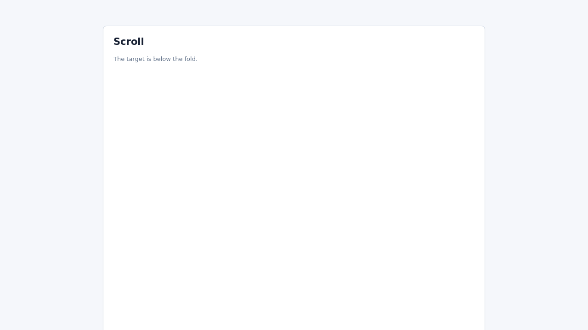
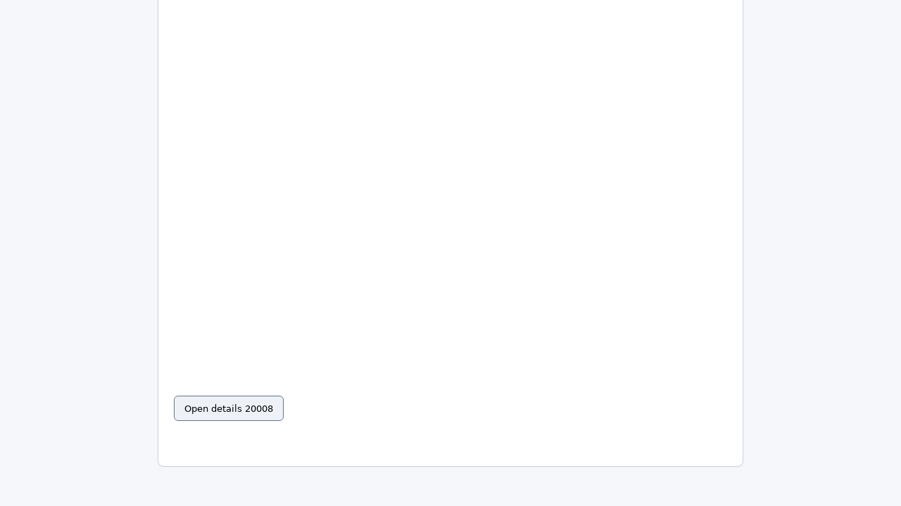
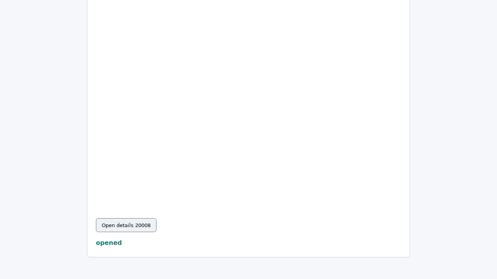

# BrowserRL GRPO 训练 Group 与 Reward 机制说明

- 生成时间：2026-05-29 14:37 CST
- 仓库：`/root/Workspace/VLM/EviTool-VL`
- 相关脚本：
  - `scripts/train_browser_rl_onpolicy_grpo.py`
  - `envs/browser_rl/playwright_env.py`
  - `envs/browser_rl/verifier.py`
  - `scripts/build_browser_rl_task_suite.py`

## 1. 先说结论

当前 BrowserRL 训练不是“一个 batch 里放很多互不相关样本”的普通 SFT 形式，而是以 `group` 为核心。

`group` 指同一个任务、同一个 step、同一个截图、同一个历史动作前缀下，对下一步动作采样出的多个候选动作。训练时比较这些候选动作的 reward，高 reward 动作被提高概率，低 reward 动作被降低概率。

当前一个 group 的基本形式是：

```json
{
  "task_id": "suite_advanced_scroll_20008",
  "step": 1,
  "screenshot": "...step01.png",
  "history": [
    {"action": {"action": "scroll", "dy": 900}, "verifier": {"progress": {"target_visible": true}}}
  ],
  "samples": [
    {"action": {"action": "click", "x": 239, "y": 757}, "reward": 0.2},
    {"action": {"action": "click", "x": 239, "y": 802}, "reward": 1.0},
    {"action": {"action": "click", "x": 254, "y": 807}, "reward": 1.0}
  ],
  "trainable": true
}
```

这里的训练信号不是“整条轨迹最终是否成功”直接反传，而是“同一个状态下不同下一步动作的相对好坏”。

## 2. verifier-guided 候选是什么意思

`verifier-guided` 指“验证器辅助”。`verifier` 是验证器，用程序检查页面状态是否完成任务，并返回 reward。`candidate` 是候选动作。

在正常采集里，当前本地 Qwen2.5-VL 会对同一个状态采样多个动作，例如：

```json
{"action":"click","x":239,"y":757}
{"action":"click","x":239,"y":802}
{"action":"click","x":245,"y":720}
```

但是 advanced_scroll 有一个探索难点：模型经常不知道应该滚多远，或者滚动后目标可见却点偏。因此训练采集阶段额外加了一些本地规则候选：

- 目标还不可见时，注入几个 scroll 候选：

```json
{"action":"scroll","dy":600}
{"action":"scroll","dy":900}
{"action":"scroll","dy":1200}
{"action":"scroll","dy":1500}
```

- 目标已经可见时，Playwright 查询 `#target` 按钮中心点，再注入几个中心附近 click 候选：

```json
{"action":"click","x":254,"y":807}
{"action":"click","x":238,"y":807}
{"action":"click","x":270,"y":807}
{"action":"click","x":254,"y":790}
{"action":"click","x":254,"y":824}
```

这些候选动作会和模型自己采出来的动作放在同一个 group 里，由 verifier 真实执行并打分。

必须注意：这不是严格纯 on-policy。严格的 `on-policy` 是当前模型自己产生动作、自己走轨迹、再用自己的轨迹训练自己。这里的本地 Qwen 采样动作是 on-policy 部分；额外注入的 verifier-guided 候选属于探索增强，带有局部规则先验。它的好处是能更快解决稀疏 reward 和探索不足；风险是如果过度依赖，会让训练偏向模板规则。

因此报告里应写成：

```text
verifier-guided on-policy / action-augmented GRPO
```

不要把它说成完全纯粹的 on-policy GRPO。后续如果要做论文级实验，应单独做 ablation，也就是消融实验：关闭 injected candidates，再比较指标。

## 3. 每个 group 到底是什么

一个 group 是一个相同状态下的多个下一步动作，不是多个完整轨迹。

更具体地说，当前采集流程是：

1. reset 任务，得到初始截图。
2. 在当前状态 `s_t` 下，让模型采样多个下一步动作。
3. 每个动作都从同一个 `s_t` 出发执行一步，得到 reward。
4. 用这些动作的 reward 计算组内 advantage。
5. 选择一个动作作为 committed action，真正推进主轨迹到下一步。
6. 到下一步后，再构造新的 group。

如果某个任务执行到第三步，那么这个 group 表示：

```text
同一个任务 + 已执行前两步动作 + 第三步当前截图 + 第三步历史信息
```

然后采样约 4-9 个“第三步下一动作”，不是采样 4-9 条完整剩余轨迹。

当前 advanced_scroll 第二轮采集统计：

```text
47 groups
328 samples
平均每个 group 约 6.98 个候选动作
```

220tg 训练集合并后统计：

```text
220 groups
1237 samples
平均每个 group 约 5.62 个候选动作
```

## 4. group 内部怎样计算优势函数

当前实现是组内标准化 reward：

```text
A_i = (r_i - mean(r_group)) / std(r_group)
```

其中：

- `r_i` 是第 i 个候选动作的 reward。
- `mean(r_group)` 是同一个 group 内所有候选动作的平均 reward。
- `std(r_group)` 是同一个 group 内 reward 的标准差。
- 如果 `std=0`，这个 group 不训练，因为所有候选一样好或一样差，没有比较信号。

训练 loss 是：

```text
L_RL = - mean_i [ A_i * log pi_theta(a_i | s, history, goal) ]
```

直觉：

- `A_i > 0`：这个动作比本 group 平均更好，提高它的概率。
- `A_i < 0`：这个动作比本 group 平均更差，降低它的概率。
- `A_i = 0`：这个动作和平均差不多，影响很小。

当前实现位置：

```text
scripts/train_browser_rl_onpolicy_grpo.py:891-915
```

## 5. 模型做当前动作时能看到 history 吗

能。当前 RL 训练和评测主要使用 `prompt_style=full`。

模型每一步看到：

- 当前截图
- 任务目标
- 当前 step
- 最大 step
- 可用动作空间
- 当前 verifier progress
- 最近历史动作，最多 `max_history=4`

history 是压缩后的文字 JSON，不包含之前所有截图。例如：

```json
[
  {
    "step": 1,
    "action": {"action": "scroll", "dy": 900},
    "exec_status": "ok",
    "verifier": {
      "success": false,
      "reward": 0.2,
      "progress": {"scrolled_down": true, "target_visible": true}
    }
  }
]
```

这意味着模型在 step1 做点击时，知道自己刚才已经 scroll 过，也知道 verifier progress 里目标已经可见。

当前 prompt 构造位置：

```text
envs/browser_rl/qwen_policy.py:189-224
```

## 6. 每一步都算进训练吗

每一步都可以形成 group，但不是每一步都会进入 loss。

进入训练需要满足：

1. 同一个状态下至少有 2 个候选动作。
2. reward 有差异，即 `reward_std > min_reward_std`。

如果某一步所有候选动作 reward 都是 0，或者全都是 1，那么这个 group 没有相对比较信息，会被记录但不参与训练。

所以当前训练不是只看最终一步，而是每一步都可能训练；只是零方差 group 会跳过。

## 7. 最多做几步

模型本身不是只能做 6 步。最大步数由任务和命令行共同限制：

```text
实际最大步数 = min(task.max_steps, --max-steps)
```

当前 2000 task suite 的 task.max_steps 分布：

| 任务类型 | 最大步数 |
| --- | ---: |
| table_action | 3 |
| advanced_dialog | 4 |
| advanced_scroll | 4 |
| advanced_tab | 4 |
| menu_select | 4 |
| choice_radio | 4 |
| choice_checkbox | 5 |
| choice_select | 5 |
| todo_add | 5 |
| form_fill | 6 |
| search_select | 6 |

最近 advanced_scroll 专项训练使用 `--max-steps 4`，所以 scroll 任务最多 4 步。val_balanced_70 评测常用 `--max-steps 6`，但 advanced_scroll 自己仍被 `task.max_steps=4` 限住。

## 8. SFT replay 是什么

`SFT` 是监督微调，意思是给模型一个状态和标准答案动作，让模型模仿这个答案。`replay` 是回放旧数据，意思是在 RL 更新时混入一些以前 SFT 的正确动作样本。

最近配置：

```text
replay_ratio = 0.40
replay_loss_weight = 0.08
```

含义：

- 每处理 1 个 RL group，期望额外抽 0.40 条 SFT 样本。
- 因为 0.40 小于 1，代码实际是用概率约 40% 抽 1 条 SFT 样本。
- 抽到后，额外计算一个小权重的 SFT loss。

总 loss 是：

```text
L_total = L_RL + lambda * L_SFT
```

其中：

```text
lambda = replay_loss_weight = 0.08
```

`L_SFT` 是普通的负对数似然：

```text
L_SFT = - log pi_theta(a_demo | s_demo)
```

它不是 KL 散度。`KL` 是 Kullback-Leibler divergence，中文常叫 KL 散度，用来衡量两个分布差异。当前实现没有单独加载 reference model，也没有计算：

```text
KL(pi_theta || pi_ref)
```

所以当前的保守项更准确叫：

```text
SFT replay NLL anchor
```

中文可以理解为“用少量旧示范动作把模型拉住，避免 RL 把原来学会的格式、点击、输入能力冲坏”。

## 9. 当前 reward 总公式

当前 reward 分两层。

第一层是环境 verifier reward：

```text
if success:
    env_reward = 1.0
elif progress_flags 存在:
    env_reward = 0.2 * true_progress_count / progress_count
else:
    env_reward = 0.0
```

第二层是训练脚本的 shaped reward：

```text
reward = env_reward
       - step_cost
       + success_bonus * 1[success]
       - invalid_penalty * 1[invalid_json_or_action]
       - exec_error_penalty * 1[exec_error]
```

最近实验基本使用默认：

```text
step_cost = 0.0
success_bonus = 0.0
invalid_penalty = 0.2
exec_error_penalty = 0.2
```

所以大多数正常合法动作的 reward 就等于 verifier reward。非法 JSON、非法 action 或执行异常会被扣分。

## 10. 不同任务类型的 reward 有什么不同

不同任务类型的 reward 不同，差异主要来自各自 verifier 检查的 DOM 条件。

`DOM` 是 Document Object Model，中文可以理解为网页内部元素树。Playwright 可以读取 DOM 状态，例如输入框的值、按钮是否出现、复选框是否勾选。

| template | 成功 reward | progress reward |
| --- | ---: | --- |
| form_fill | 正确提交后 1.0 | `name_value` 和 `code_value`，每个约 0.1 |
| search_select | 搜索后打开正确结果 1.0 | 搜索结果中出现目标按钮 0.2 |
| menu_select | 选中菜单目标项 1.0 | 菜单面板打开 0.2 |
| table_action | 点中目标行按钮 1.0 | 无 progress，错了就是 0 |
| todo_add | 添加正确 todo 1.0 | 输入框内容正确 0.2 |
| choice_checkbox | 两个目标勾选且提交 1.0 | 两个目标 checkbox，每个约 0.1 |
| choice_radio | 选中正确 radio 且提交 1.0 | 正确 radio 已选中 0.2 |
| choice_select | 选择正确选项且提交 1.0 | 内部 selected value 正确 0.2 |
| advanced_dialog | 打开弹窗并确认 1.0 | dialog 打开 0.2 |
| advanced_scroll | 点击滚动后目标 1.0 | `scrolled_down` 和 `target_visible`，每个约 0.1 |
| advanced_tab | 打开目标 tab 并点击目标 1.0 | tab 打开后目标按钮存在 0.2 |

这套 reward 的特点是简单、可验证、低成本。缺点是很多点击定位错误只有 0 或 0.2，不知道“点偏一点”和“完全点错”的距离差异。因此 advanced_scroll 下一步应该加入点击点到目标中心的连续距离 reward。

## 11. 完整图像例子：advanced_scroll

任务：

```text
suite_advanced_scroll_20008
Goal: Scroll down and open details 20008.
```

### Step 0 初始截图

目标按钮在 fold 下面。`fold` 是首屏可见区域的下边界，意思是不滚动时看不到下面的目标。



当前状态：

```text
history = []
step = 0
max_steps = 4
```

这个 group 里有 5 个候选 scroll 动作：

| 候选 | 来源 | 动作 | verifier progress | reward |
| ---: | --- | --- | --- | ---: |
| 0 | local_qwen | `scroll(dy=900)` | scrolled_down=true, target_visible=true | 0.2 |
| 1 | injected | `scroll(dy=600)` | scrolled_down=false, target_visible=true | 0.1 |
| 2 | injected | `scroll(dy=900)` | scrolled_down=false, target_visible=false | 0.0 |
| 3 | injected | `scroll(dy=1200)` | scrolled_down=false, target_visible=true | 0.1 |
| 4 | injected | `scroll(dy=1500)` | scrolled_down=false, target_visible=true | 0.1 |

这组 reward 是：

```text
r = [0.2, 0.1, 0.0, 0.1, 0.1]
mean = 0.1
std = 0.0632
```

优势函数：

```text
A(scroll 900 good) = (0.2 - 0.1) / 0.0632 = 1.581
A(scroll 900 bad)  = (0.0 - 0.1) / 0.0632 = -1.581
A(0.1 reward)      = (0.1 - 0.1) / 0.0632 = 0
```

所以这个 group 会推动模型更倾向于能让目标可见且滚动充分的动作。

### Step 1 滚动后截图

执行 committed action 后，页面进入 step1。此时目标按钮已经可见。


模型能看到的 history：

```json
[
  {
    "action": {"action": "scroll", "dy": 900},
    "verifier": {
      "success": false,
      "reward": 0.2,
      "progress": {"scrolled_down": true, "target_visible": true}
    }
  }
]
```

这个状态下，关键问题已经不是“要不要滚动”，而是“按钮中心在哪里”。

### Step 1 的候选点击动作

这个 group 有 9 个候选动作：

| 候选 | 来源 | 动作 | 成功 | reward |
| ---: | --- | --- | --- | ---: |
| 0 | local_qwen | `click(239,757)` | false | 0.2 |
| 1 | local_qwen | `click(239,802)` | true | 1.0 |
| 2 | local_qwen | `click(245,720)` | false | 0.2 |
| 3 | local_qwen | `click(237,735)` | false | 0.2 |
| 4 | injected | `click(254,807)` | true | 1.0 |
| 5 | injected | `click(238,807)` | true | 1.0 |
| 6 | injected | `click(270,807)` | true | 1.0 |
| 7 | injected | `click(254,790)` | true | 1.0 |
| 8 | injected | `click(254,824)` | true | 1.0 |

reward 列表：

```text
r = [0.2, 1.0, 0.2, 0.2, 1.0, 1.0, 1.0, 1.0, 1.0]
mean = 0.7333
std = 0.3771
```

对错误点击：

```text
A_bad = (0.2 - 0.7333) / 0.3771 = -1.414
```

对成功点击：

```text
A_good = (1.0 - 0.7333) / 0.3771 = 0.707
```

代入 loss：

```text
L_RL = - mean(A_i * log pi_theta(a_i | s))
```

含义：

- `click(239,802)`、`click(254,807)` 这类成功点击会被提高概率。
- `click(245,720)`、`click(237,735)` 这类偏高点击会被降低概率。

错误点击后的截图如下，页面没有出现 `opened` 状态：



正确点击后的截图如下，页面出现 `opened`：



这个例子说明，after-scroll click 专项修复真正修的是：

```text
滚动后目标已经可见，但模型点击坐标偏高或偏离按钮中心。
```

不是继续教模型“应该滚动”。

## 12. 当前 reward 的局限和下一步改进

当前 reward 最大的问题是点击定位信号太粗。

在上面的 step1 中：

```text
click(245,720) -> reward 0.2
click(237,735) -> reward 0.2
click(239,757) -> reward 0.2
```

它们虽然偏离程度不同，但 reward 一样。模型不知道哪个更接近目标中心。

下一步可以加入连续距离 reward：

```text
d_i = || click_i - target_center ||
r_distance = exp(- d_i^2 / (2 * sigma^2))
```

总 reward 可改为：

```text
r = 1.0 * 1[success]
  + 0.2 * progress_ratio
  + beta * 1[target_visible] * exp(-d_i^2 / (2*sigma^2))
  - gamma * 1[repeat_same_failed_click]
```

其中：

- `target_center` 来自 Playwright 的 DOM bounding box，只用于训练/verifier，不暴露给模型。
- `d_i` 是点击点到目标中心的距离。
- `beta` 控制距离奖励权重。
- `gamma` 惩罚重复点击同一个失败坐标。

这样模型就能区分：

```text
点到按钮边缘附近 > 点到按钮上方空白 > 完全点错区域
```

这比当前 0/0.2/1.0 的离散 reward 更适合修复 advanced_scroll 的坐标偏差。

## 13. 对当前实验口径的建议

后续报告建议明确分成三类：

1. `pure local_qwen samples`：当前模型自己采样的动作，严格 on-policy。
2. `verifier-guided injected samples`：训练阶段注入的探索候选，不是严格 on-policy。
3. `scripted oracle`：完全脚本策略，只用于验证任务可执行或构建 SFT，不应算作 on-policy。

如果目标是论文或更严格实验，建议做三组对比：

| 设置 | injected candidates | SFT replay | 目的 |
| --- | --- | --- | --- |
| pure on-policy | 关 | 可开或关 | 验证严格在线 RL 能力 |
| verifier-guided exploration | 开 | 开 | 追求工程效果和修复弱项 |
| SFT-only / replay-only | 关 | 只做 SFT | 判断 RL 是否真的带来提升 |

这样才能清楚回答：性能提升到底来自当前模型在线探索，还是来自 verifier-guided 候选和 SFT replay。

